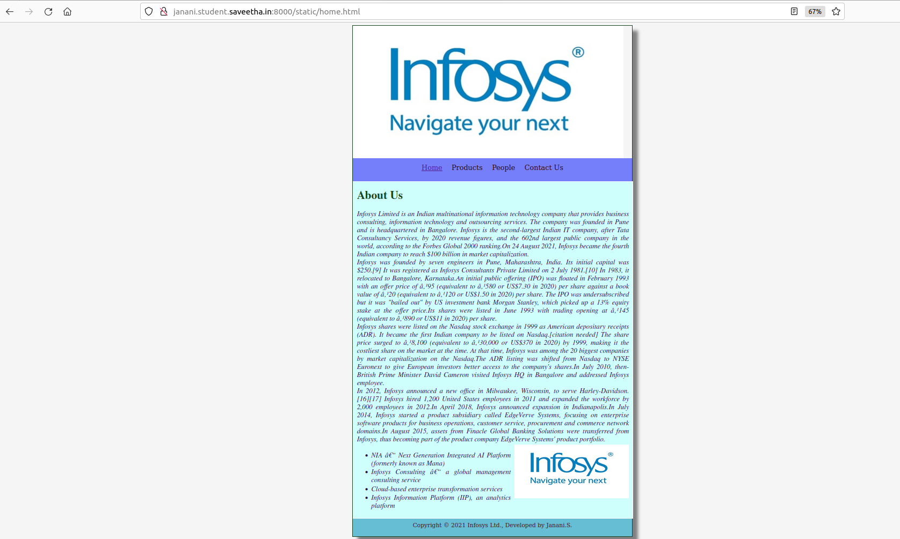
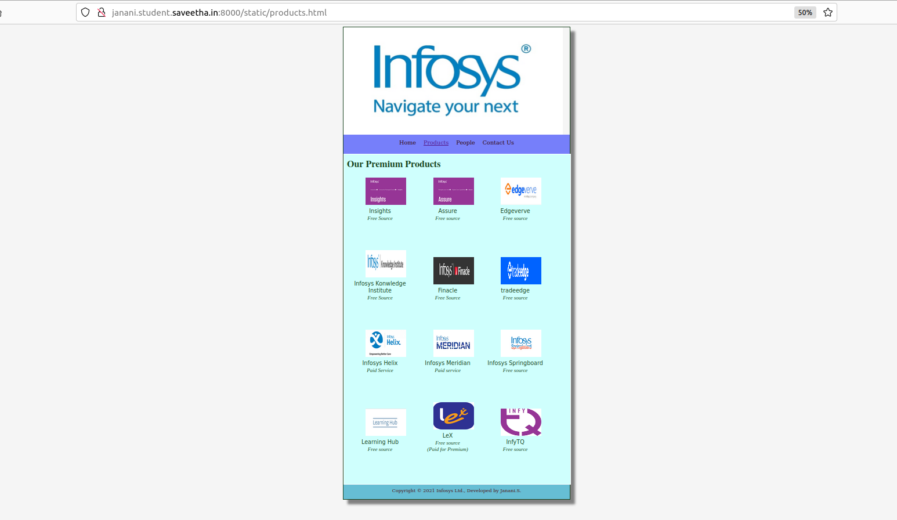
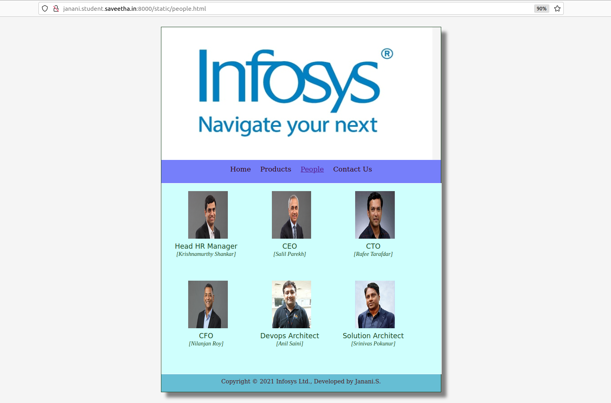
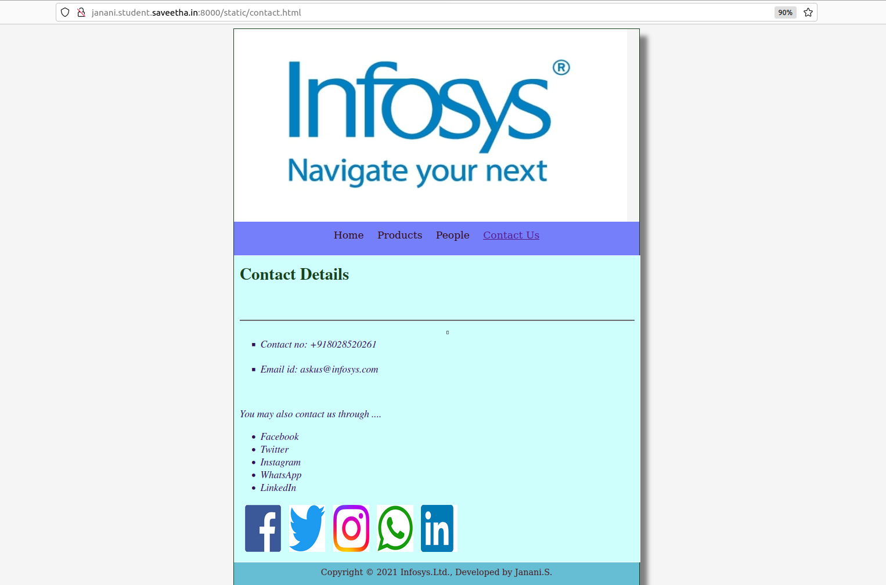
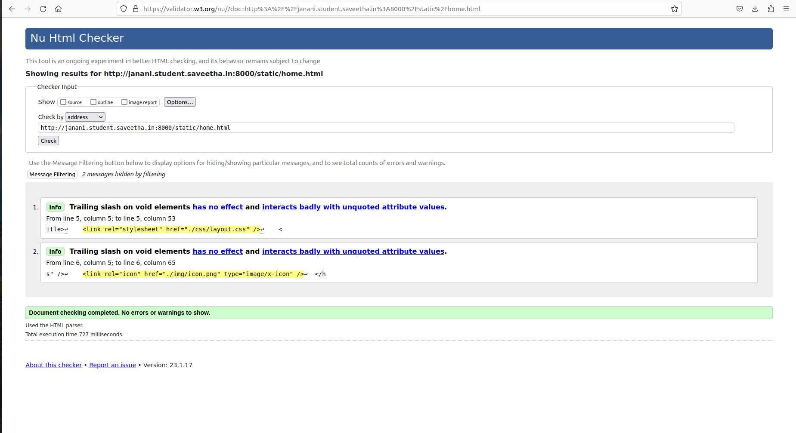

# Web Design for a Software Product Company

## AIM:

To design a static website for a software product company company.

## DESIGN STEPS:

### Step 1:

Requirement collection.

### Step 2:

Creating the layout using HTML and CSS.

### Step 3:

Updating the sample content.

### Step 4:

Choose the appropriate style and color scheme.

### Step 5:

Validate the layout in various browsers.

### Step 6:

Validate the HTML code.

### Step 6:

Publish the website in the given URL.

## PROGRAM :
#IN home.html
```
<!DOCTYPE html>
<html lang="en">
  <head>
    <title>Infosys Ltd.</title>
    <link rel="stylesheet" href="./css/layout.css" />
    <link rel="icon" href="./img/icon.png" type="image/x-icon" />
  </head>

  <body>
    <div class="container">
      <div class="banner"></div>
      <div class="menu">
        <div class="menuitemselected"><a href="/static/home.html">Home</a></div>
        <div class="menuitem"><a href="/static/products.html">Products</a></div>
        <div class="menuitem"><a href="/static/people.html">People</a></div>
        <div class="menuitem"><a href="/static/contact.html">Contact Us</a></div>
      </div>
      <div class="content">
        <div class="homecontent">
          <h1>About Us</h1>
          <div class="contenttext">
            Infosys Limited is an Indian multinational information technology company that provides business consulting, information technology and outsourcing services. The company was founded in Pune and is headquartered in Bangalore. Infosys is the second-largest Indian IT company, after Tata Consultancy Services, by 2020 revenue figures, and the 602nd largest public company in the world, according to the Forbes Global 2000 ranking.On 24 August 2021, Infosys became the fourth Indian company to reach $100 billion in market capitalization.<br>
            Infosys was founded by seven engineers in Pune, Maharashtra, India. Its initial capital was $250.[9] It was registered as Infosys Consultants Private Limited on 2 July 1981.[10] In 1983, it relocated to Bangalore, Karnataka.An initial public offering (IPO) was floated in February 1993 with an offer price of ₹95 (equivalent to ₹580 or US$7.30 in 2020) per share against a book value of ₹20 (equivalent to ₹120 or US$1.50 in 2020) per share. The IPO was undersubscribed but it was "bailed out" by US investment bank Morgan Stanley, which picked up a 13% equity stake at the offer price.Its shares were listed in June 1993 with trading opening at ₹145 (equivalent to ₹890 or US$11 in 2020) per share.<br>
           Infosys shares were listed on the Nasdaq stock exchange in 1999 as American depositary receipts (ADR). It became the first Indian company to be listed on Nasdaq.[citation needed] The share price surged to ₹8,100 (equivalent to ₹30,000 or US$370 in 2020) by 1999, making it the costliest share on the market at the time. At that time, Infosys was among the 20 biggest companies by market capitalization on the Nasdaq.The ADR listing was shifted from Nasdaq to NYSE Euronext to give European investors better access to the company's shares.In July 2010, then-British Prime Minister David Cameron visited Infosys HQ in Bangalore and addressed Infosys employee.<br>
           In 2012, Infosys announced a new office in Milwaukee, Wisconsin, to serve Harley-Davidson.[16][17] Infosys hired 1,200 United States employees in 2011 and expanded the workforce by 2,000 employees in 2012.In April 2018, Infosys announced expansion in Indianapolis.In July 2014, Infosys started a product subsidiary called EdgeVerve Systems, focusing on enterprise software products for business operations, customer service, procurement and commerce network domains.In August 2015, assets from Finacle Global Banking Solutions were transferred from Infosys, thus becoming part of the product company EdgeVerve Systems' product portfolio.<br>
           
           
            <ul>
              <li>NIA – Next Generation Integrated AI Platform (formerly known as Mana)</li>
              <li>Infosys Consulting – a global management consulting service</li>
              <li>Cloud-based enterprise transformation services</li>
              <li>Infosys Information Platform (IIP), an analytics platform</li>
            </ul>
          </div>
        </div>
      </div>
      <div class="footer">
        Copyright &#169; 2021 Infosys Ltd., Developed by Janani.S.
      </div>
    </div>
  </body>
</html>
```
#IN products.html
```
<!DOCTYPE html>
<html lang="en">
  <head>
    <title></title>
    <link rel="stylesheet" href="./css/layout.css" />
    <link rel="icon" href="./img/icon.png" type="image/x-icon" />
  </head>

  <body>
    <div class="container">
      <div class="banner"></div>
      <div class="menu">
        <div class="menuitem"><a href="/static/home.html">Home</a></div>
        <div class="menuitemselected">
          <a href="/static/products.html">Products</a>
        </div>
        <div class="menuitem"><a href="/static/people.html">People</a></div>
        <div class="menuitem"><a href="/static/contact.html">Contact Us</a></div>
      </div>
      <div class="content">
        <div class="productcontent">    
          <h1>Our Premium Products</h1>
          <div class="productitems">
              <div class="productitem"> 
                  <div class="itemimage">
                  
                  </div>
                  <div class="itemname">Insights</div>
                  <div class="itemprice">Free Source</div>
              </div>
              <div class="productitem"> 
                  <div class="itemimage">
                  
                  </div>
                  <div class="itemname">Assure</div>
                  <div class="itemprice">Free source</div>
              </div>
              <div class="productitem"> 
                  <div class="itemimage">
                  
                  </div>
                  <div class="itemname">Edgeverve</div>
                  <div class="itemprice">Free source</div>
              </div>
              <div class="productitem"> 
                  <div class="itemimage">
                  
                  </div>
                  <div class="itemname">Infosys Konwledge Institute</div>
                  <div class="itemprice">Free Source</div>
              </div>
              <div class="productitem"> 
                  <div class="itemimage">
                  
                  </div>
                  <div class="itemname">Finacle</div>
                  <div class="itemprice">Free Source</div>
              </div>
              <div class="productitem"> 
                  <div class="itemimage">
                  
                  </div>
                  <div class="itemname">tradeedge</div>
                  <div class="itemprice">Free source</div>
                  
              </div>
              <div class="productitem"> 
                  <div class="itemimage">
                  
                  </div>
                  <div class="itemname">Infosys Helix</div>
                  <div class="itemprice">Paid Service</div>
              </div>
              <div class="productitem"> 
                  <div class="itemimage">
                  
                  </div>
                  <div class="itemname">Infosys Meridian</div>
                  <div class="itemprice">Paid service</div>
              </div>
              <div class="productitem"> 
                  <div class="itemimage">
                  
                  </div>
                  <div class="itemname">Infosys Springboard</div>
                  <div class="itemprice">Free source</div>
              </div>
              <div class="productitem"> 
                  <div class="itemimage">
                  
                  </div>
                  <div class="itemname">Learning Hub</div>
                  <div class="itemprice">Free source</div>
              </div>
              <div class="productitem"> 
                  <div class="itemimage">
                  
                  </div>
                  <div class="itemname">LeX</div>
                  <div class="itemprice">Free source</div>
                  <div class="itemprice">(Paid for Premium)</div>
              </div>
              <div class="productitem"> 
                  <div class="itemimage">
                  
                  </div>
                  <div class="itemname">InfyTQ</div>
                  <div class="itemprice">Free source</div>
              </div>
          </div>
          </div>        
      </div>
      <div class="footer">
        Copyright &#169; 2021 Infosys Ltd., Developed by Janani.S.
      </div>
    </div>
  </body>
</html>
```
#IN people.html
```
html lang="en">
  <head>
    <title>Infosys Ltd.</title>
    <link rel="stylesheet" href="./css/layout.css" />
    <link rel="icon" href="./img/icon.png" type="image/x-icon" />
  </head>

  <body>
    <div class="container">
      <div class="banner"></div>
      <div class="menu">
        <div class="menuitem"><a href="/static/home.html">Home</a></div>
        <div class="menuitem"><a href="/static/products.html">Products</a></div>
        <div class="menuitemselected">
          <a href="/static/people.html">People</a>
        </div>
        <div class="menuitem"><a href="/static/contact.html">Contact Us</a></div>
      </div>
      <div class="content">
        <div class="peoplecontent">    
          <h1></h1>
          <div class="peopleitems">
              <div class="peopleitem"> 
                  <div class="itemimage">
                  
                  </div>
                  <div class="itemname">Head HR Manager</div>
                  <div class="itemprice">[Krishnamurthy Shankar]</div>
              </div>
              <div class="peopleitem"> 
                  <div class="itemimage">
                  
                  </div>
                  <div class="itemname">CEO</div>
                  <div class="itemprice">[Salil Parekh]</div>
              </div>
              <div class="peopleitem"> 
                  <div class="itemimage">
                  
                  </div>
                  <div class="itemname">CTO</div>
                  <div class="itemprice">[Rafee Tarafdar]</div>
              </div>
              <div class="peopleitem"> 
                  <div class="itemimage">
                  
                  </div>
                  <div class="itemname">CFO</div>
                  <div class="itemprice">[Nilanjan Roy]</div>
              </div>
              <div class="peopleitem"> 
                  <div class="itemimage">
                  
                  </div>
                  <div class="itemname">Devops Architect</div>
                  <div class="itemprice">[Anil Saini]</div>
              </div>
              <div class="peopleitem"> 
                  <div class="itemimage">
                  
                  </div>
                  <div class="itemname">Solution Architect</div>
                  <div class="itemprice">[Srinivas Pokunur]</div>
              </div>
          </div>
          </div>        
      </div>
      <div class="footer">
        Copyright &#169; 2021 Infosys Ltd., Developed by Janani.S.
      </div>
    </div>
  </body>
</html>
```
#IN contact.html
```
<!DOCTYPE html>
<html lang="en">
  <head>
    <title>Google .co</title>
    <link rel="stylesheet" href="./css/layout.css" />
    <link rel="icon" href="./img/icon.png" type="image/x-icon" />
  </head>

  <body>
    <div class="container">
      <div class="banner"></div>
      <div class="menu">
        <div class="menuitem"><a href="/static/home.html">Home</a></div>
        <div class="menuitem"><a href="/static/products.html">Products</a></div>
        <div class="menuitem"><a href="/static/people.html">People</a></div>
        <div class="menuitemselected">
          <a href="/static/contact.html">Contact Us</a>
        </div>
      </div>
      <div class="content">
        <div class="contactcontent">
          <h1>Contact Details</h1>
          <div class="contenttext">
              <p>
                  <br>
                </p>
                <hr>
              <ul type='square'>
              <hr size="4" width="3">
              <li>Contact no: +918028520261</li><br>
              <li>Email id: askus@infosys.com</li>
            </ul>
            <br>
            <p>You may also contact us through ....</p>
            <ul>
                <li>Facebook</li>
                <li>Twitter</li>
                <li>Instagram</li>
                <li>WhatsApp</li>
                <li>LinkedIn</li>
            </ul>
                    
          </div>
        </div>
      </div>
      <div class="footer">
        Copyright &#169; 2021 Infosys.Ltd., Developed by Janani.S.
      </div>
    </div>
  </body>
</html>
```
## OUTPUT:
### Home Page:

### Products:

### People:

### Contact:

### Html validation:


## Result:

Thus a website is designed for the software product company and the HTML,CSS code are validated.
